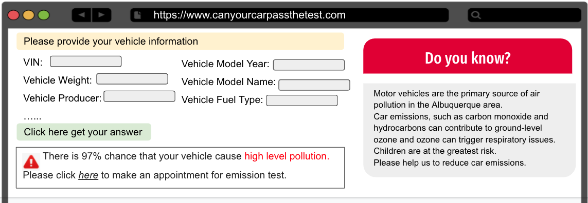
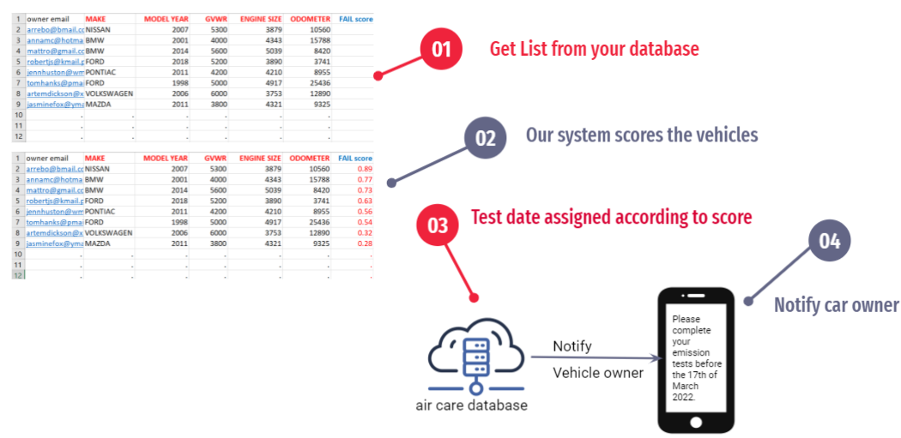

# wimlds_emissions
Predicting  which cars should be taken off the road using car emisssions data as part of our menteeship at WiMLDS (https://github.com/wimlds/berlin-ds-lab).

### Problem - bad air quality in Albuquerque

### Solution 1 
Build a web-app where vehicle owners can check how likely their vehicles pass or fail an emission test by entering vehicle information. If there is higher chance that vehicle fail the test, the owner will be directed to make an appointment for emission test and repairments. 

### Solution 2
Get list of all cars due to be tested in coming year from your air care database and gives each vehicle a fail-score. Vehicles with higher fail-scores get earlier test date.

### Would it work?
Using a Random Forest classifier we could have reduced the amount of polluting cars by 420 compared to current policy by April of 2020.

# Resources
https://www.cabq.gov/abq-data/
