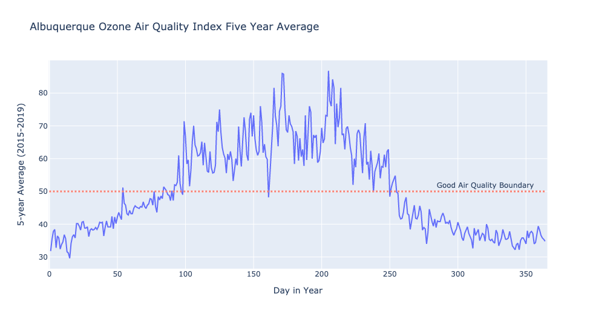
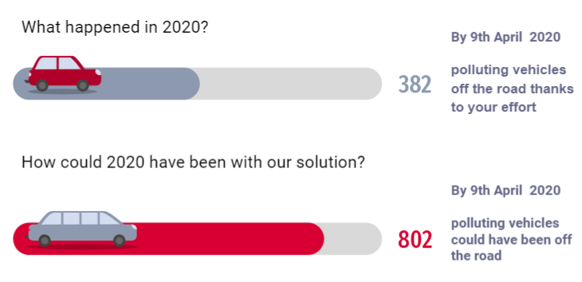

# wimlds_emissions
Predicting  which cars should be taken off the road using car emisssions data as part of our menteeship at WiMLDS (https://github.com/wimlds/berlin-ds-lab).

### Problem - bad air quality in Albuquerque

### Solution  
Build a web-app where vehicle owners can check how likely their vehicles pass or fail an emission test by entering vehicle information. If there is higher chance that vehicle fail the test, the owner will be directed to make an appointment for emission test and repairments. 

### How
Using a decision tree classifier we could have reduced the amount of polluting cars by 392 compared to current policy by June of 2020. We achieve this by calling in the cars predicted to fail their test for a checkup first.

# Resources
https://www.cabq.gov/abq-data/
